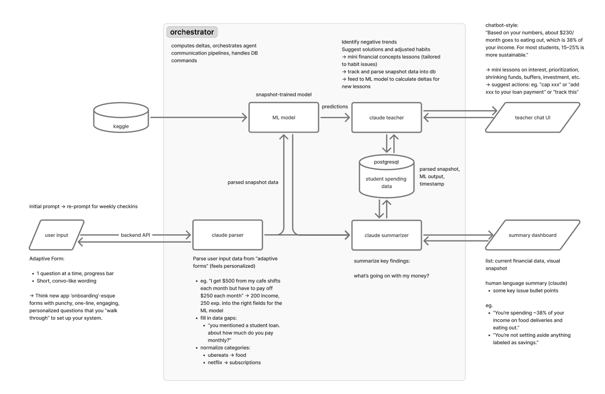

# HI-FI: AI Financial Buddy for Students 
## Project Summary

A student financial coaching app that uses ML risk prediction and Claude AI guidance to help university students understand and improve their financial health.

---
## Architecture Overview



---

## Tech Stack

### Backend
- **Framework**: FastAPI (Python)
- **Database**: PostgreSQL
- **ORM**: SQLAlchemy
- **Migrations**: Alembic
- **Validation**: Pydantic
- **LLM Integration**: Claude (Anthropic) via LangChain
- **Auth**: Google OAuth 2.0 + JWT

### Frontend
- **Framework**: React 18 with TypeScript
- **Build Tool**: Vite
- **Styling**: TailwindCSS
- **Routing**: React Router v6
- **State Management**: React Query + Context
- **Auth**: Google Identity Services
- **Charts**: Recharts

---

## Project Structure

```
humanintelligence/
├── README.md
├── .env
├── docker-compose.yml           # Docker services
├── backend/
│   ├── .env
│   ├── requirements.txt
│   ├── alembic.ini
│   ├── alembic/                 # Database migrations
│   ├── data/                    # ML training data
│   └── app/
│       ├── main.py              # FastAPI app entry
│       ├── config.py            # Configuration
│       ├── database.py          # DB connection
│       ├── models/              # SQLAlchemy models
│       ├── ml_models/           # ML models
│       ├── schemas/             # Pydantic schemas
│       ├── services/            # Business logic & agents
│       ├── routes/              # API endpoints
│       └── utils/               # Helpers & enums
└── frontend/
    ├── .env
    ├── package.json
    ├── vite.config.ts
    ├── tailwind.config.js
    └── src/
        ├── main.tsx
        ├── App.tsx
        ├── types/               # TypeScript types
        ├── api/                 # API client
        ├── hooks/               # Custom hooks
        ├── context/             # React context
        ├── components/          # Reusable components
        └── pages/               # Page components
```

---

## Development Setup

### Prerequisites
- Docker & Docker Compose
- Node.js 18+ (for frontend development)
- Python 3.11+ (for backend development)
- PostgreSQL 15+ (or use Docker)

### Environment Setup

1. **Clone the repository**
   ```bash
   git clone <repository-url>
   cd studenttrackerpredev
   ```

2. **Set up environment variables**
   ```bash
   # Backend
   cp backend/.env.example backend/.env

   # Frontend
   cp frontend/.env.example frontend/.env
   ```

3. **Configure environment variables**

   Edit `backend/.env`:
   - `DATABASE_URL`: PostgreSQL connection string
   - `ANTHROPIC_API_KEY`: Your Claude API key
   - `GOOGLE_CLIENT_ID`: Google OAuth client ID
   - `GOOGLE_CLIENT_SECRET`: Google OAuth client secret
   - `JWT_SECRET`: Secret for JWT tokens

   Edit `frontend/.env`:
   - `VITE_API_URL`: Backend API URL
   - `VITE_GOOGLE_CLIENT_ID`: Google OAuth client ID

### Running with Docker

```bash
# Start all services (database + backend)
docker-compose up -d

# View logs
docker-compose logs -f

# Stop services
docker-compose down
```

### Running Backend (Development)

```bash
cd backend

# Create virtual environment
python -m venv venv
source venv/bin/activate  # On Windows: venv\Scripts\activate

# Install dependencies
pip install -r requirements.txt

# Run database migrations
alembic upgrade head

# Start development server
uvicorn app.main:app --reload --port 8000
```

### Running Frontend (Development)

```bash
cd frontend

# Install dependencies
npm install

# Start development server
npm run dev
```

The frontend will be available at `http://localhost:5173`

## API Endpoints

### Authentication
- `POST /api/auth/google/callback` - Exchange Google auth code for JWT

### Intake
- `POST /api/intake` - Submit onboarding/check-in form data

### Dashboard
- `GET /api/dashboard` - Get user's financial dashboard data

### Teacher Chat
- `POST /api/teacher/chat` - Send message to teacher agent

---

## ML Models

This repository contains two machine learning models designed to analyze and predict student financial behavior using expense and demographic data. The project includes:

- **Overspending Regression Model** – Predicts how much a student will overspend.  
- **Financial Stress Classification Model** – Predicts whether a student is financially stressed.  
- Full **data preprocessing**, **feature engineering**, **model evaluation**, and **hyperparameter tuning** scripts.


### ML Dataset Description

The Student Spending dataset from Kaggle was used for this project. Additional columns of total_spending, total_income, adjusted_spending, overspending, savings_rate, and financial_stress were added using synthetic datapoints generated by ChatGPT. The final dataset used in this project includes student spending categories and demographic information:

| Field | Description |
|-------|-------------|
| age | Student's age |
| gender | Male/Female/Other |
| year_in_school | First–Fourth year |
| major | Student's academic major |
| preferred_payment_method | Cash, debit, credit, digital wallet |
| monthly_income | Monthly income from work |
| financial_aid | Grants or scholarships received |
| tuition, housing, food, etc. | Full spending breakdown |
| total_spending | Sum of all expenses |
| total_income | income + financial_aid |
| adjusted_spending | Spending adjusted relative to income |
| overspending | Target variable for regression |
| savings_rate | Savings ratio |
| financial_stress | Target variable for classification |

The numeric variables represent monthly spending or income amounts.  
Categorical variables represent demographic and behavioral characteristics.

### ML Preprocessing Steps

Preprocessing is applied automatically before training:

#### **Numerical preprocessing**
- StandardScaler normalization  
- Remove synthetic or redundant leakage features for classification  
  (e.g., overspending, savings_rate, adjusted_spending)

#### **Categorical preprocessing**
- OneHotEncoder for:
  - gender  
  - year_in_school  
  - major  
  - preferred_payment_method  

#### **Train/test split**
- 80/20 split  
- Stratified for the classification model

Preprocessing logic lives in:  
`src/preprocess.py`

### Models

#### **1. Overspending Regression Model**
Predicts the overspending amount in dollars.

Baseline model:  
`RandomForestRegressor(n_estimators=300, random_state=42)`

**Performance (baseline):**

| Metric | Score |
|--------|--------|
| MAE | 3.353 |
| RMSE | 28.892 |
| R² | 0.952 |


#### **2. Financial Stress Classification Model**
Predicts whether the student is financially stressed (True/False).

Baseline model:  
`RandomForestClassifier(n_estimators=400, class_weight="balanced", random_state=42)`

**Performance (baseline):**

| Metric | Score |
|--------|--------|
| Accuracy | 0.98 |
| Precision | 0.98 |
| Recall | 1.00 |
| F1 Score | 0.99 |
| ROC-AUC | 1.00 |

---

###  Training the Models

#### Train Overspending Regression
```bash
python src/train_overspending.py

##  Technologies Used

- **Python 3.11**
- **Scikit-Learn** — machine learning models & evaluation
- **Pandas** — data loading and preprocessing
- **NumPy** — numerical computations
- **Matplotlib / Seaborn** — visualizations
- **Joblib / Pickle** — model serialization
- **Jupyter Notebook** — exploratory data analysis
- **GridSearchCV / RandomizedSearchCV** — hyperparameter tuning
- **Streamlit (optional)** — interactive model demo UI
- **Git & GitHub** — version control
```

---

## Claude Agents

### Parser Agent
Converts conversational form answers into structured ML input schema.

### Summarizer Agent
Generates human-readable summary and key points for the dashboard.

### Teacher Agent
Provides personalized financial coaching with:
- Issue explanations
- Weekly action items
- Mini financial literacy lessons

---

## Database Schema

### users
- `id` (UUID, PK)
- `google_sub` (string, unique)
- `email` (string)
- `created_at`, `updated_at` (timestamps)

### spending_snapshots
- `id` (UUID, PK)
- `user_id` (UUID, FK)
- All ML input fields (integers)
- `overspending_prob`, `financial_stress_prob` (floats)
- `created_at` (timestamp)

### teacher_interactions
- `id` (UUID, PK)
- `user_id` (UUID, FK)
- `snapshot_id` (UUID, FK, nullable)
- `user_message` (text)
- `teacher_response` (JSONB)
- `created_at` (timestamp)
